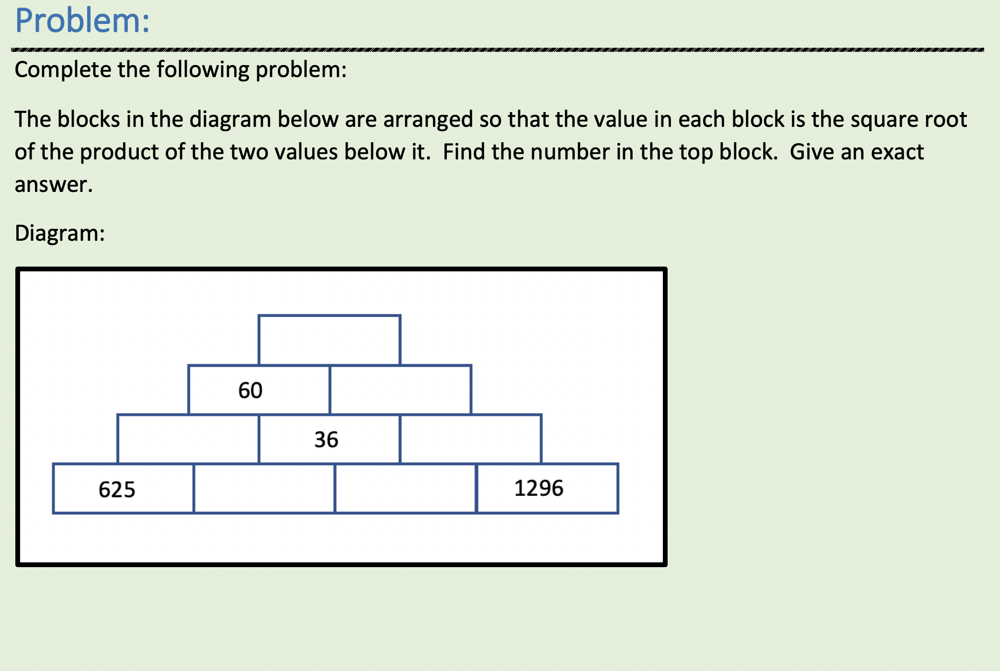

# productsquare



A professor at an Asheville college asked on a local slack for suggestions on different approaches for solving this problem in code. I'd been looking for an excuse to play with logic programming in Clojure, so here it is in core.logic. It’s extremely quick & dirty (lack of time to spend on it & unfamiliarity with core.logic), with the following compromises:
* I inelegantly repeat certain things over and over, eg declaring separately for each logic variable that it’s in the range from 1 - 1296 `((fd/in a1 (fd/interval 1 1296)))`.
* Similarly, I just declare the relationship between triplets one by one (eg `(= (* a3 a3) (* a6 a7))`) rather than capturing the structure of the pyramid,
* I omit the non-integer root element entirely because the finite domain extension of core.logic is built to deal with integers — and of course it’s trivial to calculate the root once you’ve got the rest.

My solution is [here](https://github.com/eggsyntax/productsquare/blob/master/src/eggsyntax/productsquare.clj). If I’d had more time I could have probably made it much more concise and elegant. Hopefully it still gives a general sense of how logic programming lets you just describe the problem and ask for the solution(s) you want.

## Installation

Download from https://github.com/eggsyntax/productsquare and run
```shell
clj -X eggsyntax.productsquare/-main
```

or start a REPL with
```shell
clj --eval "(require 'eggsyntax.productsquare)" --eval "(in-ns 'eggsyntax.productsquare)" --repl
```

## Usage

`clojure -M -m eggsyntax.productsquare`
